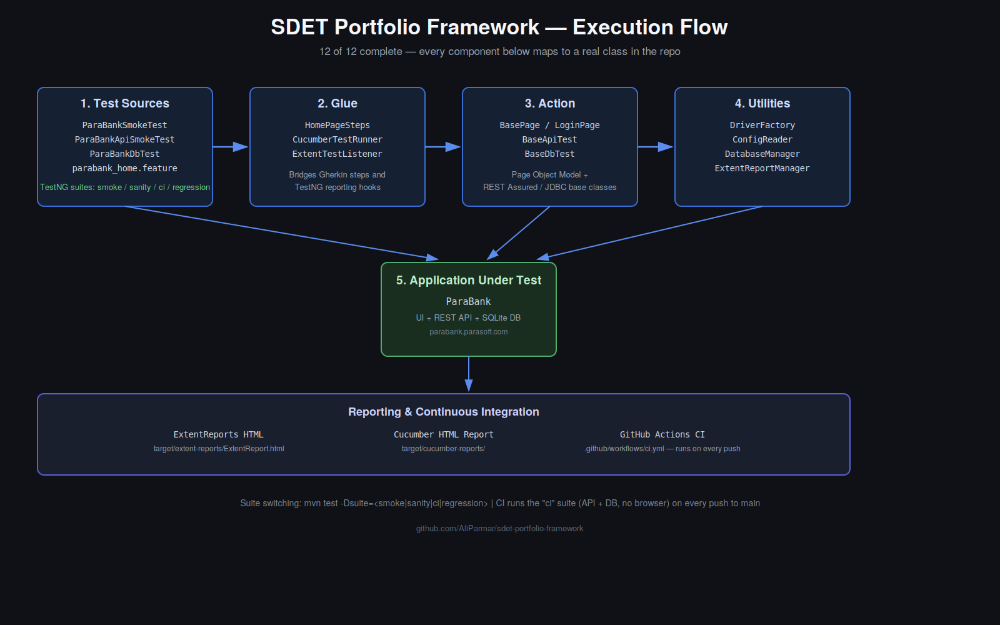

# SDET Portfolio Framework


A hybrid BDD test automation framework demonstrating end-to-end SDET capabilities across UI, API, and database layers — covering happy-path, negative-case, and data-integrity scenarios — built and run against a real public banking application.

## Architecture



*Five-layer execution flow: Test Sources → Glue → Action → Utilities → Application Under Test (ParaBank).*

## Tech Stack

- **Language:** Java 21
- **Build:** Maven
- **UI Automation:** Selenium WebDriver 4
- **Test Runner:** TestNG
- **BDD:** Cucumber 7
- **API Testing:** REST Assured + JSON Schema Validator
- **Database Testing:** JDBC (SQLite)
- **Reporting:** ExtentReports + Cucumber HTML reports
- **CI/CD:** GitHub Actions

## Application Under Test

[ParaBank](https://parabank.parasoft.com) — Parasoft's public online banking demo. Chosen for its realistic UI workflows and exposed REST API, enabling true end-to-end testing across all three layers without needing a private test environment.

## Project Structure

    src/test/
    ├── java/com/aliparmar/sdet/
    │   ├── pages/        Page Object Model classes
    │   ├── stepdefs/     Cucumber step definitions
    │   ├── runners/      TestNG Cucumber runners
    │   ├── api/          REST Assured test classes
    │   ├── db/           JDBC database test classes
    │   ├── utils/        Driver factory, config reader, ExtentReports listener
    │   └── base/         Base test classes
    └── resources/
        ├── features/        Cucumber .feature files
        ├── testng-suites/   TestNG XML suites (smoke / sanity / ci / regression)
        ├── config/          Environment properties
        └── schemas/         JSON schemas for contract validation

## Running the Tests

The framework uses a `-Dsuite` flag to switch between TestNG suite profiles without touching `pom.xml`:

```bash
# Full regression — all UI, API, and DB tests (default)
mvn test

# Smoke suite — quick cross-layer sanity check
mvn test -Dsuite=smoke

# CI suite — API + DB only, no browser required
mvn test -Dsuite=ci

# Sanity suite
mvn test -Dsuite=sanity
```

Test reports are generated at `target/extent-reports/ExtentReport.html` after each run. A sample report is committed at [`docs/sample-report/ExtentReport.html`](docs/sample-report/ExtentReport.html) for quick viewing without running the suite.

## CI/CD

Every push to `main` triggers a GitHub Actions workflow ([`.github/workflows/ci.yml`](.github/workflows/ci.yml)) that runs the `ci` suite (API + database tests — no browser, so it runs cleanly on any Linux runner). The ExtentReport is uploaded as a build artifact on each run.

UI tests are excluded from CI for now since they require a configured headless Chrome environment; the framework's `DriverFactory` already supports a `headless` flag in `config.properties` for this.

## Notable Engineering Decisions

- **JDBC layer uses SQLite, not a hosted database.** This keeps the demo fully self-contained and runnable by anyone who clones the repo — same connection-and-query pattern you'd use against MySQL or Postgres, just a different connection string.
- **Jira/Xray integration was considered and deliberately excluded.** It requires a paid plugin and there's no way to demo a real integration without one, so including it would test tool-specific trivia rather than a transferable skill.
- **Suite profiles are switched via a Maven property (`-Dsuite`), not hardcoded.** This lets one `pom.xml` serve smoke, sanity, CI, and full regression runs without duplicated Surefire configuration.
- **API tests extract IDs dynamically rather than hardcoding them.** ParaBank's public demo dataset is shared and resets periodically, so a hardcoded account ID is fragile. Tests instead query for a customer's accounts first and chain the returned ID into the next request — the same pattern used against real, frequently-changing production data.

## Author

**Ali Parmar** — SDET / Test Automation Engineer
Houston, TX
[LinkedIn](https://www.linkedin.com/in/aliparmar) • [Email](mailto:ali.parmar@att.net)
